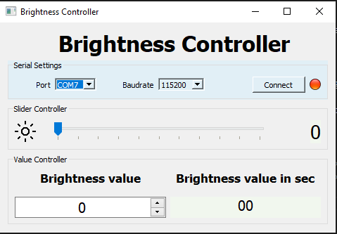
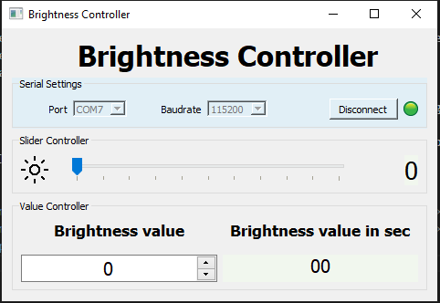

# Control-LED-Arduino
## Objetive
The objetive of this program is to design a GUI which using serial protocol to transmit data to an arduino and 
control the brightness of a led.

## Instalation
- Create a virtual environment

python -m venv env 

- Activate environmente

Windows: .\env\Scritps\activate

Linux: source env\bin\activate

- Install Requirements

pip install -r requirements.txt

- Execute the GUI

python main.py

## Interface
The interface was developed in python v3.7 with the PyQt5 package, the final code is in the main.py file
The interface has a parameter serial box on the upper left side. In this one the user can configure the Port available and the Baud Rate (default value 115200).

On the second panel there is a slider, which you can control brigthness intesity. 

On the bottom side is a box with the value of brigthness and also control it. In the other text you can see the 
value per a constant.

 
 

  

